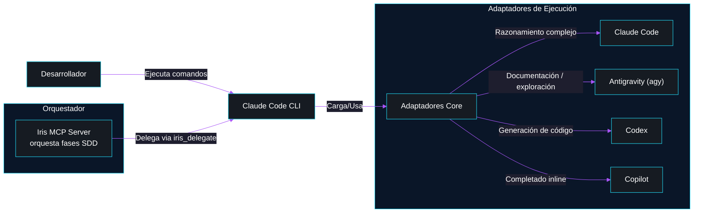
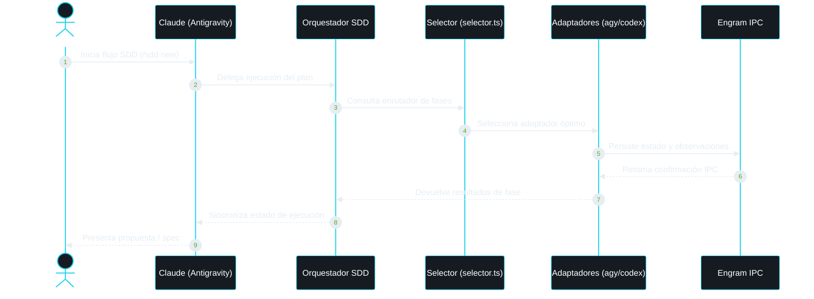
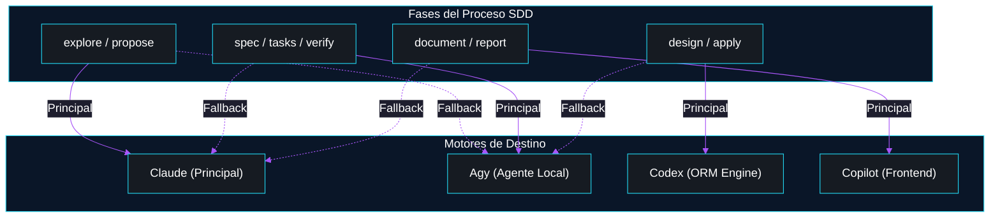
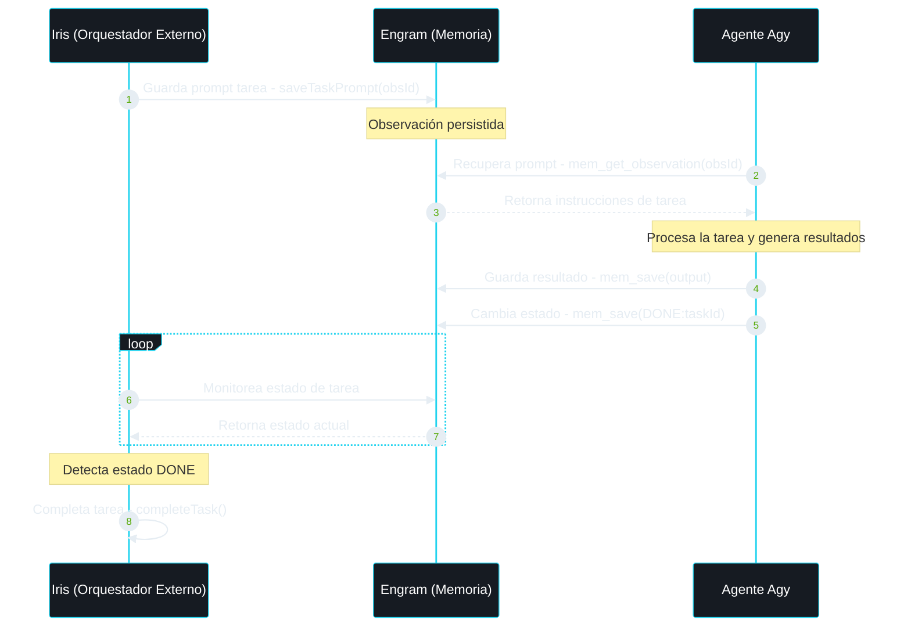
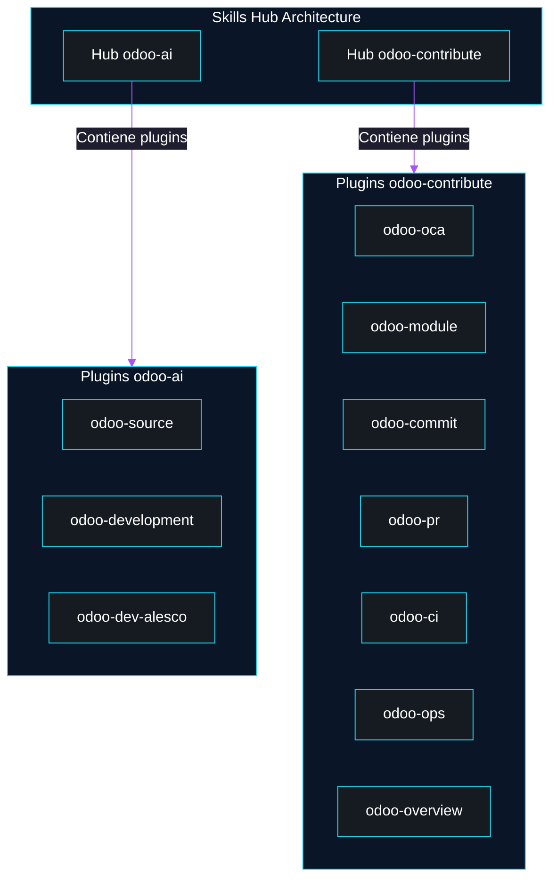
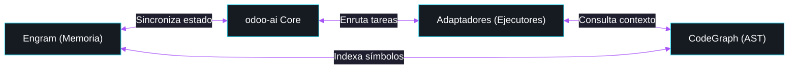

# Arquitectura del Ecosistema odoo-ai v3

> El núcleo inteligente de orquestación de agentes y adaptadores para la ingeniería de sistemas en Odoo.

---

## 1. Visión General del Ecosistema

---

## 2. Flujo de Orquestación SDD

---

## 3. Phase→Adapter Routing

### Tabla de Ruteo de Fases

| Fase | Adapter Principal | Fallback | Razón |
| :--- | :--- | :--- | :--- |
| **explore** | Claude | Agy | Análisis semántico avanzado de código y dependencias. |
| **propose** | Claude | Agy | Generación de propuestas de alto nivel alineadas al negocio. |
| **spec** | Agy | Claude | Precisión técnica y modelamiento de escenarios BDD/TDD. |
| **design** | Claude | Codex | Arquitectura de patrones y consistencia en el diseño del sistema. |
| **tasks** | Agy | Claude | Desglose granular de tareas ejecutables con criterios de aceptación. |
| **apply** | Codex | Agy | Alta eficiencia en generación de modelos Odoo, backend y ORM. |
| **verify** | Agy | Claude | Validación robusta de pruebas de integración y cobertura. |
| **document** | Copilot | Claude | Redacción fluida de documentación técnica y manuales de usuario. |
| **report** | Copilot | Claude | Reportes detallados y análisis estructurado del ciclo de vida. |

---

## 4. Engram IPC Pipeline

---

## 5. Skills Hub Architecture

---

## 6. Decisiones de Arquitectura

| Decisión | Alternativas consideradas | Razón elegida | Trade-offs |
| :--- | :--- | :--- | :--- |
| **Engram como IPC en lugar de archivos .txt** | Archivos locales temporales .txt, Redis local, base de datos PostgreSQL. | Mayor robustez de persistencia entre reinicios de contenedores/sesiones y acoplamiento nativo con la memoria a largo plazo del ecosistema. | Ligera latencia adicional de red (milisegundos) en la serialización, pero se gana aislamiento absoluto del filesystem. |
| **fire_and_forget para tareas de documentación** | Espera síncrona en hilo de ejecución bloqueante. | Los reportes e informes de documentación tardan más tiempo y no deben bloquear el flujo de desarrollo activo de código. | Requiere monitoreo asíncrono secundario, pero incrementa significativamente la velocidad de respuesta del orquestador. |
| **Phase→adapter routing estático vs dinámico** | Enrutamiento dinámico basado en LLM Router. | Mayor determinismo técnico y menor consumo de tokens al asignar fases predecibles a adaptadores óptimos. | Menor adaptabilidad automática ante tareas altamente atípicas, pero mayor fiabilidad en producción. |
| **confirm_threshold como two-phase commit** | Commit directo de una sola fase (Auto-commit). | Garantiza que tanto la memoria del agente como los archivos físicos estén sincronizados antes de marcar la fase como exitosa. | Aumento en el número de operaciones de red, pero elimina por completo los estados inconsistentes. |
| **summary truncado en lugar de output completo** | Retorno de outputs completos en cada llamada del CLI. | Prevención del desbordamiento del contexto de la conversación (bloat), lo que preserva la consistencia semántica. | El orquestador debe consultar explícitamente Engram para obtener detalles finos de la ejecución si los requiere. |
| **CodeGraph para búsqueda estructural** | Búsqueda exacta de cadenas por ripgrep (grep), Semble (semántico). | AST real via tree-sitter: ~57% menos tokens y ~71% menos tool calls. Sub-millisecond lookups. Sin indexación periódica — file watcher automático. | Requiere inicialización del índice (`codegraph init`), pero no depende de vectores semánticos ni embeddings. |

---

## 7. Flujo de Datos

---

## Integraciones del Ecosistema

| Herramienta | Repositorio | Rol | Relación |
|-------------|-------------|-----|----------|
| Iris MCP Server | github.com/Geraldow/iris | Orquestador multi-agente: delega tareas SDD a Claude, Gemini, Codex, Copilot según la fase | Integración externa — proyecto separado |
| Engram | engram.sh | Memoria persistente cross-session | Dependencia directa |
| CodeGraph | github.com/colbymchenry/codegraph | Búsqueda estructural de código AST (tree-sitter), MCP server | Dependencia directa |
