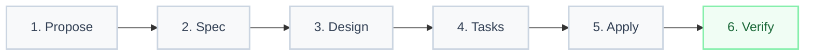

# PRD: odoo-ai v3

> **El copiloto definitivo y orquestador multi-agente para el desarrollo profesional y escalable en Odoo.**

**Version**: 3.0.0
**Author**: Fairw / Alesco Perú
**Date**: 2026-05-24
**Status**: Draft

---

## 1. Problem Statement

El desarrollo y personalización sobre el ecosistema de **Odoo** (tanto en su versión Community como Enterprise) representa uno de los retos más complejos en la consultoría de software empresarial actual. En mi experiencia implementando sistemas ERP a gran escala, he identificado que la falta de herramientas integradas orientadas específicamente a la arquitectura de Odoo genera ineficiencias críticas en los equipos de ingeniería:

1. **Fragmentación arquitectónica y violación de convenciones:** Los desarrolladores noveles o generalistas suelen omitir las directrices estrictas de la OCA (Odoo Community Association), inyectando lógica de negocio directamente en las vistas XML, estructurando erróneamente los métodos del ORM o ignorando la separación limpia entre capas. **El problema central no es la capacidad del programador, sino la falta de un validador en tiempo real y especializado en el modelo mental de Odoo.**
2. **Pérdida de contexto e historial de decisiones:** Los modelos de lenguaje tradicionales carecen de persistencia de sesión nativa. Al alternar entre la definición de modelos Python, herencias de vistas XML y reglas de acceso CSV, el agente olvida las decisiones previas, lo que conduce a código redundante, inconsistencias en los campos técnicos y regresiones de software.
3. **Bloqueos por latencia y costos en flujos síncronos:** Obligar a un único modelo costoso y de alta latencia a realizar todas las fases del ciclo de desarrollo (desde la exploración inicial de base de datos hasta la generación de código masivo) resulta insostenible financieramente y frustrante para la productividad del desarrollador.
4. **Ausencia de un marco estructurado de planificación (SDD):** Escribir código directamente sin un diseño técnico previo en Odoo resulta catastrófico debido a la alta interdependencia de sus componentes (Modelos -> Vistas -> Seguridad -> Datos). Sin un diseño previo y un flujo estructurado, los agentes cometen errores frecuentes en IDs externos XML y flujos de herencia del ORM.

**odoo-ai v3** resuelve estas deficiencias de raíz, transformando el desarrollo reactivo en un proceso estructurado, altamente orquestado y centrado en la calidad arquitectónica. Mediante el uso inteligente de agentes especializados, memoria de largo plazo y enrutamiento dinámico, el ecosistema garantiza que cada línea de código respete estrictamente los patrones de diseño y escalabilidad que los negocios de clase mundial exigen en Odoo.

---

## 2. Vision

**El ecosistema de desarrollo para Odoo definitivo: un orquestador multi-agente capaz de auto-organizarse, aprender del código existente y automatizar el ciclo de vida del software bajo estándares OCA y metodologías Spec-Driven Development (SDD).**

**odoo-ai v3** no es simplemente un generador de plantillas XML o Python; es un arquitecto virtual experto. A través de una CLI unificada, integra de manera nativa memoria persistente compartida, control semántico de código y flujos asíncronos distribuidos en múltiples agentes especialistas.

* **Antes:** El desarrollador escribe un modelo Python, luego intenta generar manualmente la vista XML en un chat convencional de IA, teniendo que explicarle a la máquina de nuevo toda la estructura del modelo, nombres de campos técnicos y relaciones, arriesgándose a cometer errores de validación de sintaxis XML u olvidando declarar las reglas de acceso en `ir.model.access.csv`.
* **Después:**
  ```bash
  odoo-ai new "Crear módulo de gestión de contratos de servicios con flujos de aprobación y vistas Kanban"
  ```
  El sistema inicializa un flujo **SDD (Spec-Driven Development)**, enruta la fase de exploración a un modelo veloz y económico (`agy`), propone y diseña la especificación completa usando `claude`, valida la arquitectura de 6 capas Odoo, escribe el código de forma segura en una rama aislada y ejecuta pruebas unitarias locales garantizando cobertura total antes de fusionar.

---

## 3. Target Users

### Primary
- **Arquitectos y Consultores Odoo Sénior:** Profesionales que necesitan diseñar e implementar soluciones empresariales complejas, asegurando la escalabilidad del modelo de datos y el cumplimiento estricto de las reglas OCA.
- **Desarrolladores Backend & Frontend Odoo (Módulos OCA/Custom):** Ingenieros encargados de la programación diaria de modelos (Python), controladores, vistas XML y componentes dinámicos en el framework OWL.
- **Líderes Técnicos y de DevOps en Odoo:** Responsables de automatizar los procesos de calidad, revisión de código (Quality Gates) e integración continua en repositorios corporativos de Odoo.

### Secondary
- **Desarrolladores Junior en transición a Odoo:** Programadores que necesitan un sistema interactivo de mentoría en tiempo real para entender el flujo de las 6 capas de Odoo sin cometer errores comunes de principiante.
- **Ingenieros de Aseguramiento de la Calidad (QA) para Odoo:** Profesionales dedicados a estructurar y automatizar pruebas unitarias (`TransactionCase`) y de integración (`HttpCase`).

---

## 4. Supported Platforms

| Agente | Versión Mínima | Prioridad | Rol y Ecosistema de Integración |
| :--- | :--- | :---: | :--- |
| **Claude Code** | v0.x (Latest) | **P0** | Agente primario para síntesis lógica compleja, codificación ORM, y refactorizaciones críticas. |
| **Antigravity CLI** | v1.x (Latest) | **P0** | Motor de orquestación, interacción local con el usuario, exploración ágil de contexto y ejecución de tareas de scaffolding. |
| **Cursor** | v0.45+ | **P1** | IDE visual primario para la edición manual complementada con sugerencias contextuales basadas en `.cursorrules` generadas por `odoo-ai`. |
| **Codex** | v2.x | **P1** | Generación de scripts auxiliares, estructuración rápida de archivos de datos XML y pre-poblamiento de bases de datos. |
| **Copilot** | v1.250+ | **P2** | Autocompletado rápido inline en el editor para agilizar la escritura mecánica de XML y firmas de métodos Python. |

---

## 5. Prerequisites & Dependency Management

Para garantizar un funcionamiento robusto de la suite multi-agente, el entorno de desarrollo debe estar equipado con una serie de dependencias e interfaces de comunicación que habiliten el flujo de datos unificado.

### 5.0.1 Estrategia de Resolución de Dependencias
El instalador e inicializador de **odoo-ai v3** valida de forma secuencial la presencia de los motores de ejecución y persistencia locales. Al iniciar el proyecto con `odoo-ai init`, se realiza un mapeo del ecosistema local para asegurar que los puertos de comunicación IPC estén disponibles.

### 5.0.2 Matriz de Dependencias Obligatorias

| Dependencia | Versión Mínima | Obligatorio | Propósito en el Ecosistema |
| :--- | :--- | :---: | :--- |
| **Engram** | v2.4.0+ | Sí | Motor de memoria semántica persistente y caché local de decisiones arquitectónicas. |
| **Iris MCP Server** | v1.2.0+ | Sí | Servidor de protocolo de contexto para control y delegación asíncrona de agentes. |
| **agy** (Antigravity CLI) | v1.0.0+ | Sí | Orquestador de terminal local y despachador de flujos asíncronos. |
| **CodeGraph** | `v0.9.4+` | `Sí` | `Motor de búsqueda estructural de código basado en AST (tree-sitter). Integrado como MCP server en Claude Code. ~57% menos tokens y ~71% menos tool calls que alternativas semánticas.` |
| **Odoo (Core)** | v16.0 / v17.0 / v18.0 | Sí | Entorno de ejecución de Odoo para validación del ORM, compilación y pruebas unitarias. |
| **PostgreSQL** | v13.0+ | Sí | Motor de base de datos requerido para el funcionamiento del framework de Odoo. |

---

## 6. Core Features

### 6.1 Phase→Adapter Routing
El sistema implementa un enrutador dinámico que optimiza la distribución de tareas durante el ciclo de vida del desarrollo. En lugar de procesar todo el flujo con un único modelo masivo, cada fase de la metodología de desarrollo se delega al adaptador óptimo:

| Fase SDD | Adaptador Recomendado | Justificación Técnica | Prioridad |
| :--- | :--- | :--- | :---: |
| **Explore** | `agy` (Antigravity CLI) | Alta velocidad de lectura, indexación de archivos locales y bajo coste de contexto. | **P0** |
| **Propose** | `claude` (Claude Code) | Razonamiento superior para consolidar el alcance, detectar impactos cruzados en módulos existentes y estructurar la propuesta de cambios. | **P0** |
| **Design** | `agy` (Antigravity CLI) | Estructuración técnica rápida de la solución en archivos de especificaciones basándose en patrones establecidos. | **P0** |
| **Apply** | `claude` (Claude Code) | Capacidades inigualables para escribir código backend robusto, vistas complejas XML y realizar refactorizaciones precisas del ORM. | **P0** |
| **Document** | `agy` (Antigravity CLI) | Generación eficiente de documentación técnica de bajo nivel, esquemas de tablas y resúmenes de cambios. | **P1** |

---

### 6.2 Engram IPC (Inter-Process Communication)
Para evitar bloqueos y optimizar la experiencia de usuario, **odoo-ai v3** utiliza Engram como bus de datos e IPC para la comunicación asíncrona entre agentes.

* **Fire and Forget:** Un agente principal puede disparar tareas pesadas de análisis o indexación semántica en segundo plano sin interrumpir la sesión interactiva del desarrollador.
* **Polling Activo:** Monitoreo y escucha activa de cambios de estado en las tareas background consultando de manera incremental a Engram a través de identificadores de observación únicos (`obsId`).
* **Sincronización Transversal:** Almacenamiento unificado de decisiones arquitectónicas. Si un agente crea una nueva especificación de modelo Python, esa firma queda registrada en Engram y está disponible instantáneamente para el agente que diseña la vista XML en otra terminal o IDE.

| Capacidad | Descripción | Prioridad |
| :--- | :--- | :---: |
| `fire_and_forget` | Despacho de tareas asíncronas de indexación y pruebas en background. | **P0** |
| `polling` por `obsId` | Monitoreo en tiempo real del progreso de subtareas delegadas a sub-agentes. | **P0** |
| `shared_context` | Canal común de comunicación para sincronización de metadatos de modelos Odoo. | **P0** |

---

### 6.3 SDD Workflow integrado para Odoo
Implementación estricta de la metodología de **Desarrollo Guiado por Especificaciones (Spec-Driven Development)** adaptado al ciclo de vida de Odoo. El flujo es unidireccional y secuencial:



1. **Propose:** Definición a alto nivel del requerimiento de negocio y alcance del módulo Odoo.
2. **Spec:** Redacción de casos de uso y escenarios de aceptación detallados (BDD) orientados a flujos empresariales.
3. **Design:** Definición de la arquitectura técnica: diagrama UML de base de datos, herencias de modelos, nuevos campos y flujos lógicos de negocio.
4. **Tasks:** Desglose granular de actividades técnicas en un check-list (TODO list) manejado de forma dinámica.
5. **Apply:** Escritura de código (Python, XML, CSV, JS) por lotes incrementales, asegurando la no regresión de componentes existentes.
6. **Verify:** Ejecución automática de pruebas de validación (`TransactionCase`), linters y chequeo de cumplimiento OCA.

| Entregable | Estándar de Calidad | Prioridad |
| :--- | :--- | :---: |
| `proposal.md` | Detalle claro de objetivos de negocio y limitaciones técnicas. | **P0** |
| `specs.md` | Escenarios Gherkin detallados para las vistas e interacciones del ERP. | **P0** |
| `design.md` | Diseño físico del modelo relacional, herencias Odoo, y seguridad a nivel de registros (Record Rules). | **P0** |
| `tasks.md` | Plan de trabajo incremental con trazabilidad a nivel de commit. | **P0** |

---

### 6.4 Skills Hub (odoo-ai, odoo-contribute, skill-evolver)
Un almacén dinámico y centralizado de capacidades cognitivas diseñadas específicamente para el ecosistema Odoo:

* **odoo-ai (Core):** Skill maestro con el conocimiento profundo de las directrices del ORM de Odoo (decoradores de API `@api.depends`, `@api.onchange`, `@api.constrains`), estructura de vistas XML, flujos de trabajo de aprobación y componentes OWL.
* **odoo-contribute (OCA QA):** Automatización del flujo de contribución externa. Valida de manera estricta que el código respete la estructura modular OCA, formatea los archivos de traducción `.po`, genera el archivo `CHANGELOG.md` siguiendo convenciones internacionales, y crea Pull Requests limpios en GitHub.
* **skill-evolver:** Algoritmo de meta-aprendizaje que analiza patrones repetitivos de desarrollo en el repositorio local (por ejemplo, implementaciones recurrentes de pasarelas de pago o flujos logísticos) y auto-genera "Skills" reutilizables para los agentes de IA, logrando un sistema que se auto-mejora continuamente.

| Capacidad | Función Clave | Prioridad |
| :--- | :--- | :---: |
| Validaciones OCA | Asegurar cumplimiento de linters (`pylint-odoo`) y convenciones de nombres. | **P0** |
| Auto-Generación PR | Empaquetado automático de código, changelog estructurado y creación de rama remota limpia. | **P1** |
| Meta-Aprendizaje | Evolución de nuevas directrices de agentes a partir de la retroalimentación del programador. | **P2** |

---

### 6.5 Búsqueda Estructural de Código (CodeGraph)
Integración nativa con **CodeGraph** para proporcionar un motor de búsqueda de código ultrarrápido basado en árboles de sintaxis abstracta (AST) en repositorios masivos de Odoo. A diferencia de las alternativas semánticas basadas en vectores, CodeGraph analiza la estructura del código utilizando `tree-sitter`, permitiendo resolver consultas complejas y lecturas en submilisegundos directamente desde el código fuente vivo. Se integra nativamente como un servidor MCP (Model Context Protocol) dentro de Claude Code.

* **Contexto Estructural Preciso:** En lugar de realizar búsquedas textuales (`grep`) ineficientes o aproximaciones vectoriales imprecisas, el agente consulta la estructura real del código (definiciones de clases, herencias, métodos y decoradores) garantizando máxima exactitud técnica.
* **Mapeo de Relaciones en Odoo:** Permite navegar de manera precisa por la jerarquía de herencias de modelos (`_inherit`), dependencias y llamadas a métodos del ORM sin la sobrecarga ni latencia de procesamientos semánticos pesados.
* **Reducción Drástica de Tokens:** Al no requerir bases de datos vectoriales externas ni embeddings complejos, inyecta al contexto únicamente las definiciones y referencias estructurales estrictamente necesarias, reduciendo significativamente el consumo de tokens y llamadas a herramientas.

| Capacidad | Descripción | Prioridad |
| :--- | :--- | :---: |
| Búsqueda estructural | Localizar la declaración exacta de modelos, campos y funciones en el AST en submilisegundos. | **P0** |
| Navegación de herencia | Rastrear herencias (`_inherit`) y sobreecritura de métodos a lo largo de múltiples módulos. | **P1** |
| Integración MCP nativa | Consumo directo por parte del agente a través del protocolo MCP integrado en Claude Code. | **P1** |

---

### 6.6 Modo Aprendizaje y Arquitectura de 6 Capas
Fiel a nuestra filosofía educativa de que los errores son escalones hacia la maestría, **odoo-ai v3** incorpora un **Modo Aprendizaje** interactivo. Este framework de mentoría desglosa la construcción de cualquier característica en **6 capas estructuradas de Odoo**, asegurando que el desarrollador comprenda la justificación detrás de cada línea:

```
┌─────────────────────────────────────────────────────────┐
│              6 CAPAS DE ARQUITECTURA ODOO               │
├─────────────────────────────────────────────────────────┤
│  6. Pruebas Unitarias e Integración (TransactionCase)    │
│  5. Capa Web/Front (OWL Components y JS Widgets)        │
│  4. Controladores y Endpoints HTTP (Lógica Externa)     │
│  3. Vistas XML (Form, Tree, Kanban, Search, Action)     │
│  2. Seguridad y Permisos (ir.model.access, Record Rules)│
│  1. Capa de Datos (Modelos Python, Campos y ORM)         │
└─────────────────────────────────────────────────────────┘
```

1. **Capa 1: Capa de Datos (Modelos y ORM):** Definición de la estructura de base de datos, campos técnicos (`fields.Char`, `fields.Many2one`, etc.) y restricciones a nivel de PostgreSQL.
2. **Capa 2: Seguridad y Permisos:** Creación del archivo de accesos CSV y reglas de registro basadas en grupos de seguridad para protección de datos.
3. **Capa 3: Vistas y UI/UX:** Maquetación XML de los componentes del ERP (formularios, listas, tableros Kanban, menús y acciones de ventana).
4. **Capa 4: Controladores HTTP:** Exposición de endpoints API REST/JSON-RPC para integración con plataformas externas.
5. **Capa 5: Capa Web (OWL Framework):** Desarrollo de componentes de interfaz modernos e interactivos usando la librería OWL (Odoo Web Library).
6. **Capa 6: Pruebas y QA:** Implementación de pruebas automatizadas y validación de cobertura de código.

El agente no escribirá el código de la Capa 3 sin antes verificar que el programador comprende y ha validado la seguridad de la Capa 2, impulsando un proceso de mentoría activa.

---

## 7. Out of Scope (v3)

Para esta versión 3.0.0, los siguientes requerimientos e integraciones quedan explícitamente fuera del alcance del proyecto, con miras a implementarse en versiones futuras:

* **Despliegue directo a producción en plataformas SaaS / Odoo.sh:** El ecosistema de **odoo-ai** se enfocará exclusivamente en el ciclo de vida local de desarrollo y preparación de Pull Requests. La entrega final queda a cargo de los sistemas de CI/CD del cliente.
* **Migraciones automatizadas de versiones mayores de Odoo:** La refactorización y conversión automática de código (ej: de Odoo v15 a v18) no formará parte de los objetivos de esta versión, debido a la alta variabilidad en los esquemas relacionales nativos de Odoo.
* **Soporte nativo para sistemas operativos móviles o entornos cloud sin terminal (Cloud IDEs sin shell local):** Se requiere un entorno local basado en terminal que soporte Node.js y comunicación por socket.

---

## 8. Success Metrics

La efectividad y el impacto del ecosistema **odoo-ai v3** en los flujos de ingeniería se evaluarán bajo el siguiente marco de indicadores clave:

| Métrica | Línea Base (Desarrollo Convencional) | Target v3 (odoo-ai) | Método de Medición |
| :--- | :--- | :--- | :--- |
| **Tiempo de desarrollo de módulos base** | 12 - 16 horas de estructuración y scaffolding inicial. | **Menos de 4 horas** de inicio a fin. | Trazabilidad del tiempo desde la creación del `proposal.md` hasta la verificación de la Capa 6. |
| **Tasa de fallos en Integración Continua (CI)** | 35% de Pull Requests rechazados por linters de Odoo o convenciones de nomenclatura. | **Menos de 5%** de rechazos. | Reporte automatizado de errores detectados en la suite de CI/CD con relación al uso del skill `odoo-contribute`. |
| **Cobertura de pruebas unitarias mínima** | 15% - 20% promedio en proyectos personalizados. | **Mayor al 80%** en componentes generados. | Análisis del reporte de cobertura de `coverage.py` durante la ejecución automatizada de la Capa 6. |
| **Satisfacción del desarrollador y adopción** | Curva de aprendizaje empinada y frustración en vistas XML heredadas. | **Adopción diaria fluida** con reporte de mentoría interactivo. | Encuestas de NPS interno y análisis del volumen de comandos `odoo-ai` exitosos ejecutados por sesión. |

---

## 9. Risks

El desarrollo e implementación del ecosistema presenta desafíos técnicos que han sido analizados y mitigados detalladamente:

| Riesgo Detectado | Probabilidad | Impacto | Estrategia de Mitigación Técnica |
| :--- | :---: | :---: | :--- |
| **Alucinación de campos técnicos y herencias en Odoo** | Alta | Crítico | Integración con CodeGraph MCP para inyectar únicamente campos y modelos reales detectados en el AST vivo. |
| **Regresión de funcionalidad de módulos estándar** | Media | Alto | Implementación estricta del **Branch Safety Protocol** y validación en sandbox a través de pruebas de integración antes de consolidar cambios. |
| **Latencia elevada en la orquestación multi-agente** | Alta | Medio | Aplicación de **Phase→Adapter Routing**, descargando en modelos locales y de bajo coste (`agy`) las tareas de exploración e indexación de archivos, reservando modelos complejos para fases de generación de código. |
| **Inconsistencias en el mapeo de reglas de acceso (Capa 2)** | Baja | Crítico | El validador de **Modo Aprendizaje** bloquea de forma mandatoria la generación de vistas si no se ha detectado la existencia de la regla de acceso CSV correspondiente para el nuevo modelo. |

---

## 10. Roadmap

El plan de entrega incremental se estructura en tres fases clave para asegurar la estabilidad técnica y la correcta adopción del ecosistema:

| Fase | Título y Entregables Clave | Duración Estimada |
| :---: | :--- | :---: |
| **Fase 1** | **Estructura Core y Ruteo de Fases:** Implementación de la CLI de base, Phase→Adapter Routing, y persistencia a través de Engram IPC. | Semanas 1 - 3 |
| **Fase 2** | **Skills Hub y Modo Aprendizaje:** Desarrollo completo del skill `odoo-ai` y la lógica de validación secuencial de las 6 capas de arquitectura de Odoo. | Semanas 4 - 6 |
| **Fase 3** | **Seguridad y Control Estructural:** Integración nativa con `CodeGraph`, afinamiento del `confirm_threshold` de doble firma, y despliegue del Branch Safety Protocol. | Semanas 7 - 9 |
