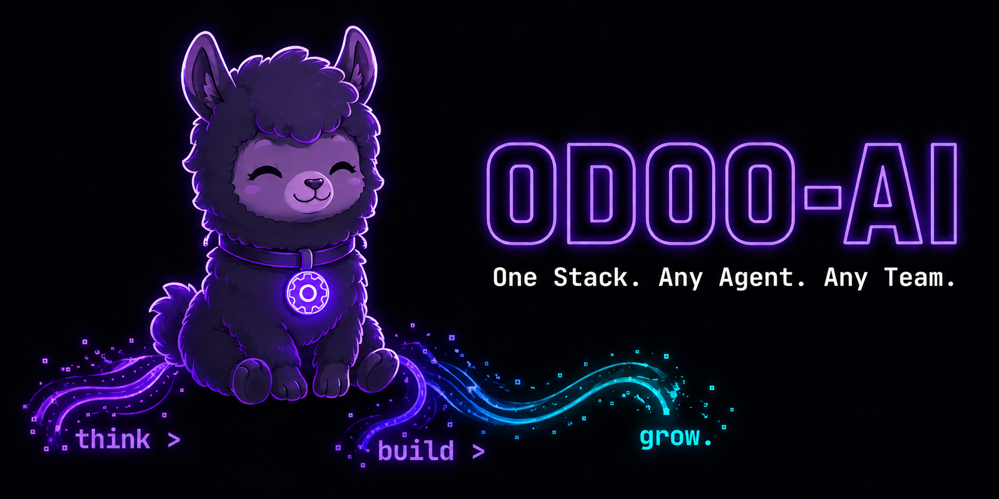
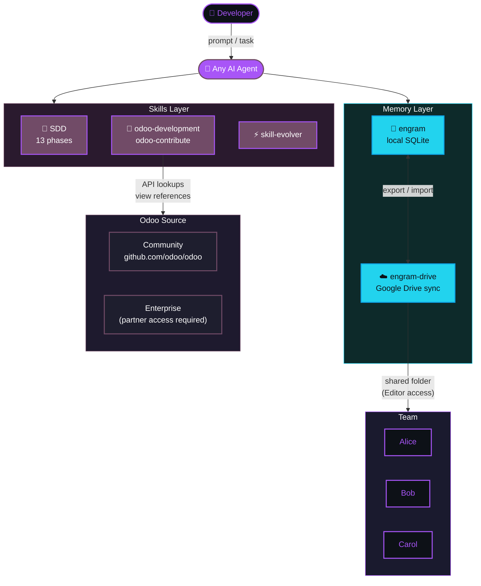
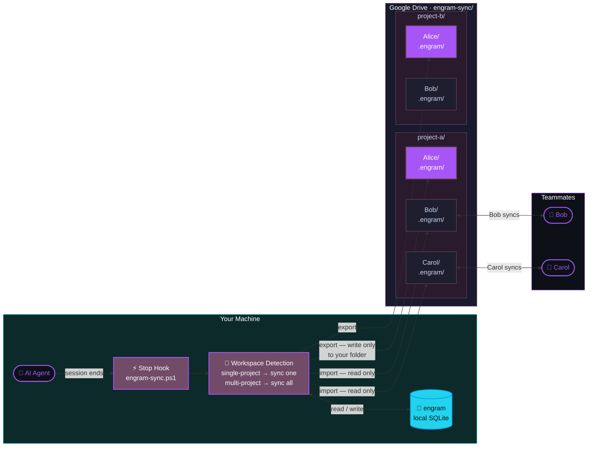
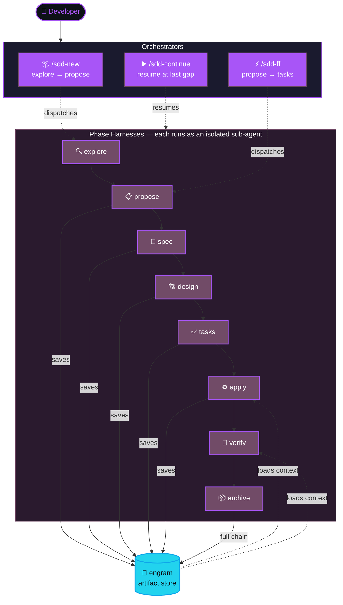

<div align="center">


**One framework. Any agent. Any Odoo version.**

*Persistent memory that compounds across sessions. Spec-driven workflow before every line of code.*  
*Multi-agent orchestration. Team knowledge sync. Zero vendor lock-in.*

---

[Quick Start](#quick-start) • [Skills](#skills-included) • [Architecture](#architecture) • [Team Memory](#team-memory-sync) • [SDD Workflow](#spec-driven-development) • [Odoo Setup](#odoo-source-setup) • [Credits](#credits)

</div>

---

## Why odoo-ai?

Most AI coding tools forget everything when the session ends. Most Odoo projects repeat the same patterns, the same bugs, and the same architectural decisions — across every module, every sprint, every new team member.

**odoo-ai** is a skills framework that turns your AI agent into a senior Odoo architect that never forgets.

| Without odoo-ai | With odoo-ai |
|---|---|
| Agent starts every session from scratch | Agent remembers decisions, bugs, and conventions from all previous sessions |
| Each developer re-discovers the same patterns | Team knowledge is shared automatically via Google Drive |
| Code is written before the spec exists | Every change starts with a proposal, goes through design, and ends with verified implementation |
| Agent gives generic answers | Agent knows your Odoo version, your modules, your codebase |

---

## Skills included

| Skill | What it does |
|---|---|
| [`engram-drive`](skills/engram-drive/) | Sync team memory via Google Drive — each member writes exclusively to their own folder, imports from everyone else. Zero conflicts, zero servers. |
| [`odoo-development`](skills/odoo-development/) | Full Odoo development hub — models, computed fields, views, ORM patterns, security rules, OWL components, automated tests. Covers versions 14–19. |
| [`odoo-contribute`](skills/odoo-contribute/) | Git workflow, branch safety checks, CI/CD pipelines, OCA conventions, and conventional commit standards. |
| `sdd-init` `sdd-explore` `sdd-new` `sdd-propose` `sdd-spec` `sdd-design` `sdd-tasks` `sdd-ff` `sdd-apply` `sdd-verify` `sdd-report` `sdd-continue` `sdd-archive` | 13 Spec-Driven Development skills — a complete methodology from exploration to archived implementation. |
| [`skill-evolver`](skills/skill-evolver/) | Detects reusable patterns that emerge during development sessions and codifies them into new skills automatically. |

---

## Architecture



---

## Quick start

### Prerequisites

Before running the installer, make sure you have the following:

| Requirement | Why it's needed |
|---|---|
| [Claude Code](https://claude.ai/code) or any AI agent | The runtime that loads and executes the skills |
| [engram plugin](https://github.com/Gentleman-Programming/engram): `claude plugin install engram` | Persistent memory layer — stores and retrieves observations across sessions |
| [Google Drive for Desktop](https://drive.google.com/drive/download) | Mounts your Drive as a local folder — required for team memory sync via `engram-drive` |
| [PowerShell 7+](https://github.com/PowerShell/PowerShell/releases) (`pwsh`) | The cross-platform shell used by all installer and sync scripts. **Not** the legacy Windows PowerShell 5.x that ships with Windows — version 7 or higher is required. Windows 11 users can install it from the Microsoft Store. |
| [git](https://git-scm.com) | Required to clone this repo and to auto-clone Odoo Community source |
| Odoo source code (versions 14–19) | Used by `odoo-development` for API lookups, view references, and module analysis |

### Installation

```powershell
# 1. Clone the repo
git clone https://github.com/Geraldow/odoo-ai.git

# 2. Run the installer
cd odoo-ai
pwsh -File install.ps1
```

The installer will walk you through:

1. **Prerequisite check** — verifies Claude Code, engram, git, PowerShell 7+, and Google Drive
2. **Version selection** — auto-detects your Odoo version from existing projects, or asks you to choose (14–19)
3. **Community source** — clones `github.com/odoo/odoo` at the selected version if not already present (~1.5 GB shallow clone)
4. **Enterprise source** — if you have an active Odoo subscription, you can link your existing Enterprise copy or clone it yourself
5. **Skills installation** — copies all skills to `~/.claude/skills/`
6. **Hook scripts** — copies all hook scripts to `~/.claude/scripts/`
7. **Hooks configuration** — injects the hooks block into `~/.claude/settings.json` automatically (skips if hooks are already present)
8. **Config generation** — creates `~/.claude/engram-sync-config.json` with your detected Odoo paths pre-filled

### Keeping plugins up to date

To pull the latest version of all external plugins from their original repositories:

```powershell
pwsh -File update.ps1
```

Then re-run `install.ps1` (or copy the updated plugins manually) to apply changes to your skills directory.

### First run

Open your AI agent in your Odoo project directory, then:

```
/engram-drive setup     → detect environment, configure team, create Drive folders
/sdd-init               → initialize Spec-Driven Development for this project
```

> Hooks are configured automatically by the installer. No manual `settings.json` edits required.

---

## Hooks

The `scripts/` directory contains Claude Code hooks that run automatically during sessions. They are installed to `~/.claude/scripts/` by `install.ps1` and activated by adding the block from `config-templates/settings-hooks.template.json` to your `~/.claude/settings.json`.

| Script | Hook event | What it does |
|---|---|---|
| `engram-detect.py` | `SessionStart` | Detects which engram project is active based on CWD; injects `project=` reminder into context |
| `odoo-detect.py` | `SessionStart` | Detects `__manifest__.py` in CWD; injects mandatory odoo-development skill loading sequence |
| `engram-session-start.ps1` | `SessionStart` + `PostCompact` | Imports teammates' latest memories from Google Drive at session open |
| `sdd_task_check.py` | `UserPromptSubmit` + `PostCompact` | Injects SDD task-size classification reminder before every prompt |
| `sdd_odoo_check.py` | `PreToolUse` | Guards Odoo file edits — reminds to run `/sdd-ff` for Moderado/Complejo tasks |
| `engram-project-track.py` | `PostToolUse` | Tracks active engram project as files are edited; injects `project=` update on context switch |
| `engram-session-end.ps1` | `Stop` | Exports your memories to Google Drive + imports teammates' latest at session close |
| `engram-sync.ps1` | Manual / `Stop` | Smart sync — detects single-project vs multi-project workspace and syncs accordingly |

---

## Odoo source setup

The `odoo-development` skill uses a local copy of the Odoo source for API lookups, view references, and accurate module analysis. The installer creates this structure automatically:

```
C:\Development\Odoo\
├── 19\
│   ├── community\     ← cloned automatically from github.com/odoo/odoo
│   └── enterprise\    ← linked from your existing copy (partner access required)
├── 18\
│   ├── community\
│   └── enterprise\
├── 17\ ...
├── 16\ ...
├── 15\ ...
└── 14\ ...
```

**Community source** is public and cloned automatically during installation.  
**Enterprise source** requires an active Odoo subscription (partners and customers). The installer will ask for the path to your existing copy and create a junction link — no duplication needed.

> Community-only setups are fully supported. Leave `odoo.enterprise_path` empty in `~/.claude/engram-sync-config.json` and the skill will use Community source for all lookups.

---

## Team memory sync

`engram-drive` uses Google Drive as a conflict-free sync backend. Each team member writes **exclusively** to their own subfolder and imports (read-only) from teammates. No server required. No manifest conflicts.

```
Google Drive/Engram/engram-sync/
├── your-project/
│   ├── Alice/       ← only Alice writes here
│   ├── Bob/         ← only Bob writes here
│   └── Carol/       ← only Carol writes here
└── another-project/
    ├── Alice/
    └── Bob/
```



**To onboard a new teammate:**

1. Share the project subfolder in Google Drive: right-click → Share → add their email as **Editor**
2. They clone this repo and run `pwsh -File install.ps1`
3. They open their AI agent and run `/engram-drive setup`
4. Memory sync begins automatically from that point forward

> Access control is handled entirely by Google Drive sharing. Share only the project subfolders relevant to each teammate — not the entire `engram-sync/` root.

---

## Spec-Driven Development

Every substantial change follows a structured pipeline before a single line of code is written:

```
explore → propose → spec → design → tasks → apply → verify → archive
```



**Run the full pipeline in one command:**

```
/sdd-ff "add approval workflow to purchase orders"
```

This single command orchestrates exploration of the existing codebase, writes a technical proposal, generates a full specification, produces a design document, and breaks everything into actionable tasks — all before implementation begins.

**Individual phases are also available:**

```
/sdd-explore   → investigate the codebase and identify patterns
/sdd-propose   → draft a technical proposal with tradeoffs
/sdd-spec      → write a detailed specification
/sdd-design    → produce the architectural design
/sdd-tasks     → break design into implementation tasks
/sdd-apply     → implement in batches with rollback support
/sdd-verify    → run tests and validate the implementation
/sdd-archive   → store the full artifact chain in memory
```

---

## Repository structure

```
odoo-ai/
├── assets/
│   └── odoo-ai-banner.png
├── install.ps1                    ← run this first
├── update.ps1                     ← pull latest external plugins
├── scripts/                       ← Claude Code hook scripts (installed to ~/.claude/scripts/)
│   ├── engram-detect.py           ← SessionStart: detect active engram project
│   ├── odoo-detect.py             ← SessionStart: detect Odoo project, load skill
│   ├── sdd_task_check.py          ← UserPromptSubmit + PostCompact: SDD size guard
│   ├── sdd_odoo_check.py          ← PreToolUse: SDD compliance on Odoo file edits
│   ├── engram-project-track.py    ← PostToolUse: track active project on file edit
│   ├── engram-session-start.ps1   ← SessionStart + PostCompact: import teammate memories
│   ├── engram-session-end.ps1     ← Stop: export + import memories at session close
│   └── engram-sync.ps1            ← Manual sync: single-project or multi-project
├── skills/
│   ├── engram-drive/              ← team memory sync via Google Drive
│   ├── odoo-development/          ← Odoo development hub (v14–19)
│   ├── odoo-contribute/           ← git, CI/CD, and contribution workflow
│   ├── sdd-init/                  ← SDD: initialize
│   ├── sdd-explore/               ← SDD: codebase exploration
│   ├── sdd-new/                   ← SDD: new change orchestrator
│   ├── sdd-propose/               ← SDD: technical proposal
│   ├── sdd-spec/                  ← SDD: specification
│   ├── sdd-design/                ← SDD: architectural design
│   ├── sdd-tasks/                 ← SDD: task breakdown
│   ├── sdd-ff/                    ← SDD: fast-forward (full pipeline)
│   ├── sdd-apply/                 ← SDD: implementation
│   ├── sdd-verify/                ← SDD: verification
│   ├── sdd-report/                ← SDD: closure report
│   ├── sdd-continue/              ← SDD: resume interrupted pipeline
│   ├── sdd-archive/               ← SDD: archive artifacts
│   ├── skill-evolver/             ← pattern detection and codification
│   └── _shared/                   ← shared utilities across all skills
├── config-templates/
│   ├── engram-sync-config.template.json   ← template for ~/.claude/engram-sync-config.json
│   └── settings-hooks.template.json       ← hooks block to add to ~/.claude/settings.json
├── LICENSE
└── README.md
```

---

## Credits

odoo-ai is built on the shoulders of outstanding open-source work:

| Project | Author | Contribution |
|---|---|---|
| [Gentle AI](https://github.com/Gentleman-Programming/gentle-ai) | [Gentleman Programming](https://github.com/Gentleman-Programming) | Foundation architecture: SDD methodology, harness system, and skill registry that this framework extends |
| [Engram](https://github.com/Gentleman-Programming/engram) | [Gentleman Programming](https://github.com/Gentleman-Programming) | Persistent memory plugin — the knowledge layer that makes agents remember across sessions and across teammates |
| [odoo-plugins](https://github.com/ahmed-lakosha/odoo-plugins) | [ahmed-lakosha](https://github.com/ahmed-lakosha) | 8 specialized Odoo plugins: Docker, frontend/themes, i18n, reports, security, services, testing, and upgrade migrations |
| [odoo-claude-skills](https://github.com/maingocdoan1809/odoo-claude-skills) | [maingocdoan1809](https://github.com/maingocdoan1809) | Odoo development and E2E testing skills for Claude Code |
| [odoo-claude-skills](https://github.com/PeterUrban111/odoo-claude-skills) | [PeterUrban111](https://github.com/PeterUrban111) | Curated skills covering actions, API, QWeb, server actions, and visual patterns |
| [agent-skills](https://github.com/unclecatvn/agent-skills) | [unclecatvn](https://github.com/unclecatvn) | Agent-oriented skill architecture and Odoo development patterns |
| [odoo-development-skill](https://github.com/fhidalgodev/odoo-development-skill) | [fhidalgodev](https://github.com/fhidalgodev) | Universal Odoo development skill based on strict OCA standards (v14–19), with code review and upgrade analysis agents |

---

## License

MIT — see [LICENSE](LICENSE) for details.

---

<div align="center">
<sub>Inspired by <a href="https://github.com/Gentleman-Programming/gentle-ai">Gentle AI</a> — adapted with care for Odoo teams everywhere.</sub>
</div>
